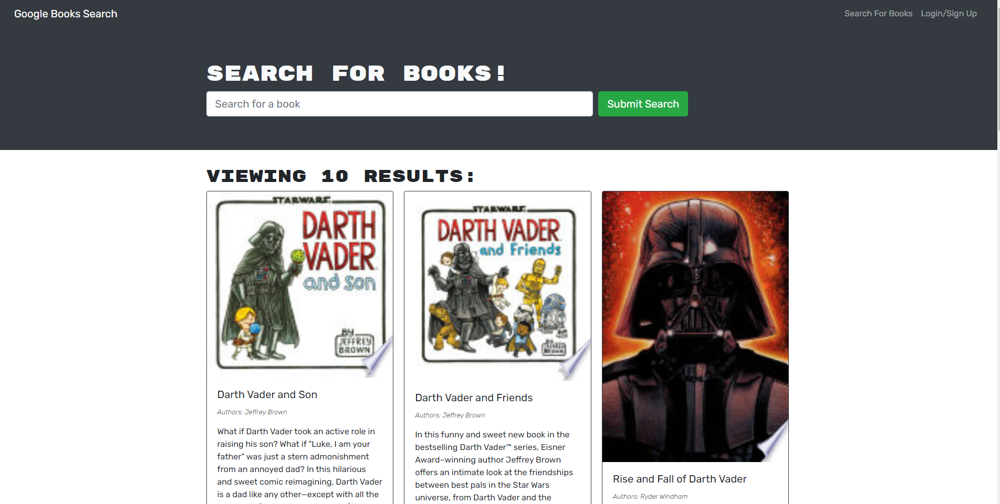

# Book-Search-Engine

  ## Description
  This project's goal was to refactor a fully functional Google Books API from using a RESTFul API to a GraphQL API built with Apollo Server. This application was built using the MERN stack with React for the front end, MongoDB database, and Node.js/Express.js server and API. The refactored version has been deployed through Heroku (https://safe-dusk-63747.herokuapp.com/). This app allows users to search any book as well as signup for an account that allows you to save any searched books to that account.  

  ;

  ## Table of Contents
  - [Installation](#installation)
  - [Usage](#usage)
  - [Credits](#credits)
  - [License](#license)
  - [Tests](#tests)
  - [Questions](#questions)

  ## Installation
  In order to install you must clone this repository and once that is complete you must run `npm install` in the terminal at the root of the repository. In order to run both servers at the same time you must be in the root of the repository and rum `npm start`. 

  ## Usage
  The primary use of this application is to allow users to search books and when thay have signed up can save books to a list attached to their account. Searched books will show the user the title, author, description, and an image of the book's cover.

  ## Credits
  Diego Rivera

  ## License
   
  To read more on the license, [The Unlicense](http://unlicense.org/)
  
  # Questions

  ## GitHub: 
  Account Name: Diegorivera1110  
  Link: https://github.com/Diegorivera1110

  ## Email Address: 
  diegorivera1110@gmail.com

